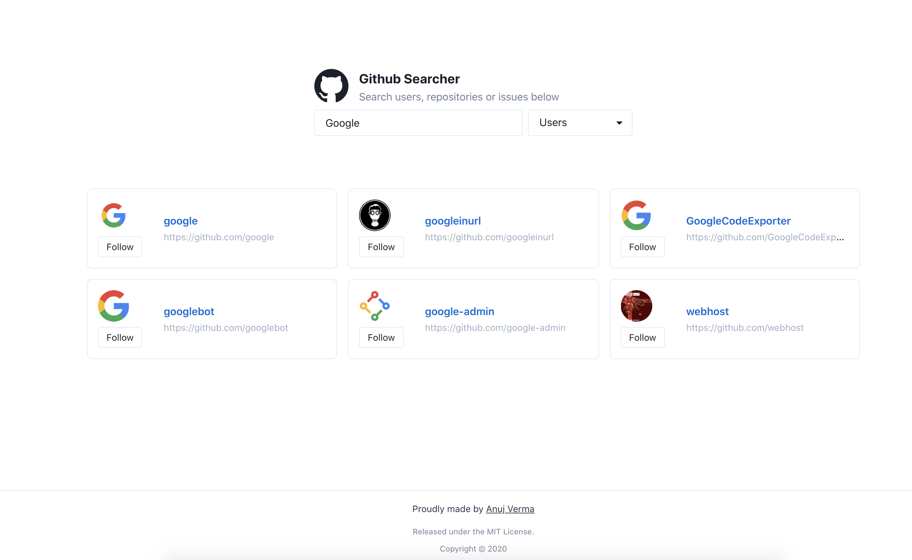

<br />
<p align="center">
    
  </a>

  <h3 align="center">GitHub Searcher</h3>

  <p align="center">
    This project is using GitHub's public<a href="https://docs.github.com/en/rest/reference/search"> Search API </a> to perform the search for users, repositories and issues.
    <br />
    <br />
    <br />
    <a href="https://nextjs-snowy-one-63.vercel.app/">View Demo</a>
    ·
    <a href="https://github.com/anujverma000/git-searcher/issues">Report Bug</a>
  </p>
</p>


<!-- TABLE OF CONTENTS -->
## Table of Contents

* [About the Project](#about-the-project)
  * [Built With](#built-with)
* [Getting Started](#getting-started)
  * [Installation](#installation)
* [Roadmap](#roadmap)
* [Contact](#contact)


<!-- ABOUT THE PROJECT -->
## About The Project



<br />
<br />
<br />
<br>
There are two input fields, one search field for the user to type the text and a dropdown where user can either pick "Users", "Repositories" or "Issues" to define the entities that they want to search. 


### Built With
This is a [Next.js](https://nextjs.org/) project bootstrapped with [`create-next-app`](https://github.com/vercel/next.js/tree/canary/packages/create-next-app).

* [NextJS](https://nextjs.org/)
* [Typescript](https://www.typescriptlang.org/)
* [React](https://reactjs.org/)
* [Redux](https://redux.js.org/)
* [Redux-persist](https://github.com/rt2zz/redux-persist)

For Deployment, Using vercel's Github build pipeline
* [Vercel](https://vercel.com/) 


<!-- GETTING STARTED -->
## Getting Started

To get a local copy up and running follow these simple steps.

### Installation

1. Clone the repo
```sh
git clone https://github.com/anujverma000/git-searcher.git
```
2. Install NPM packages
```sh
npm install
```


3. Run the development server:

```bash
npm run dev
```

<!-- ROADMAP -->
## Roadmap

See the [open issues](https://github.com/anujverma000/git-searcher/issues) for a list of proposed features (and known issues).

<!-- CONTACT -->
## Contact

Anuj Verma - [@anujverma000](https://twitter.com/anujverma000) - anujverma000@gmail.com

Project Link: [https://github.com/anujverma000/git-searcher](https://github.com/anujverma000/git-searcher)
